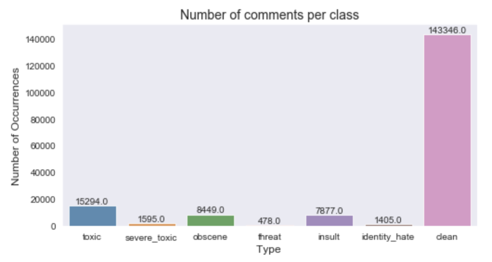
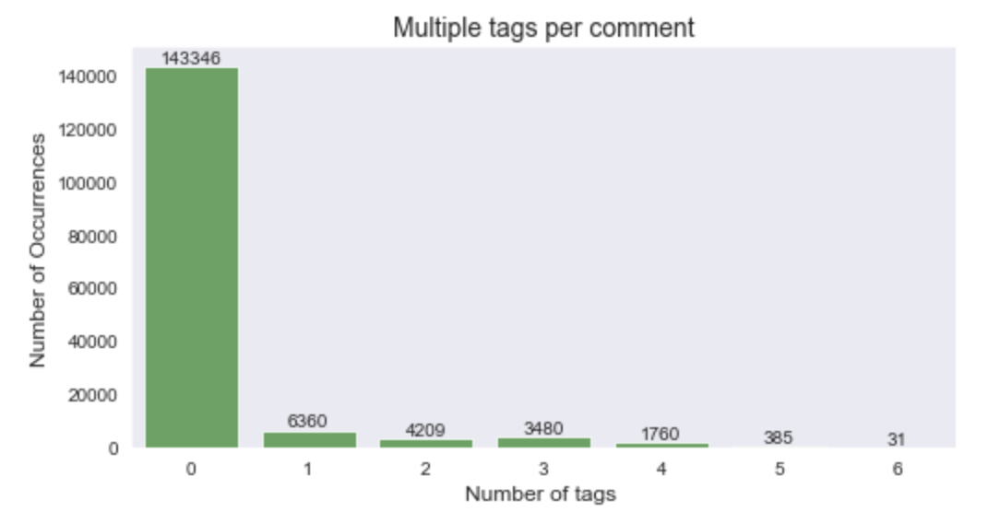
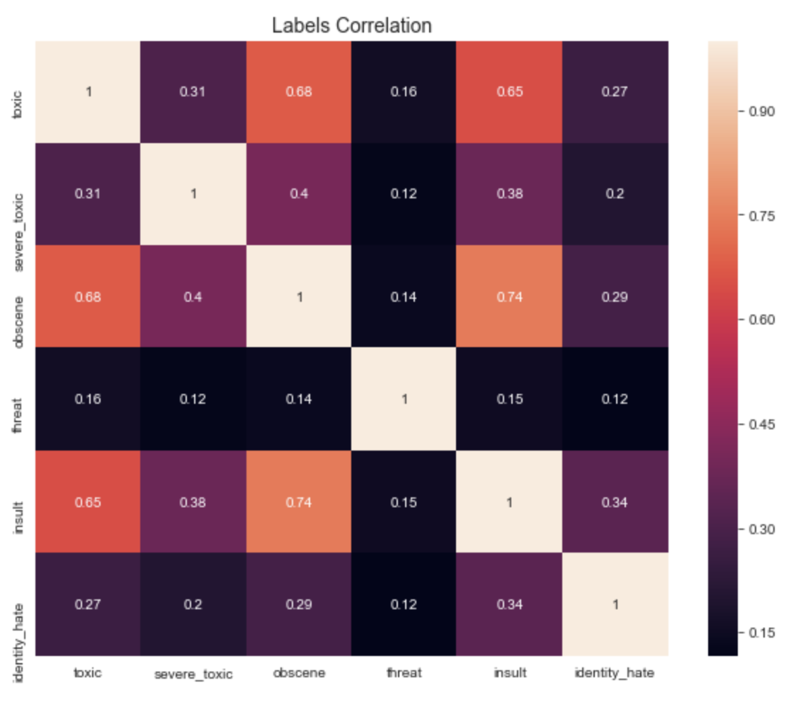
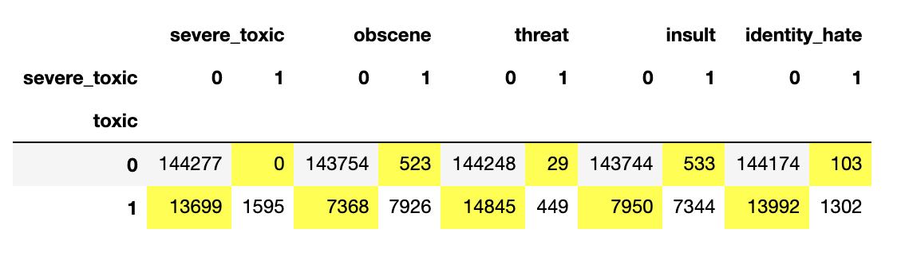
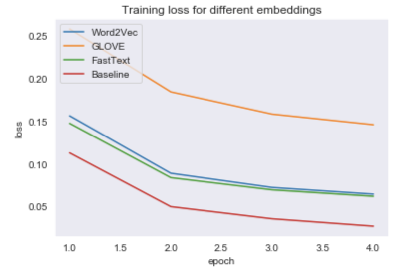
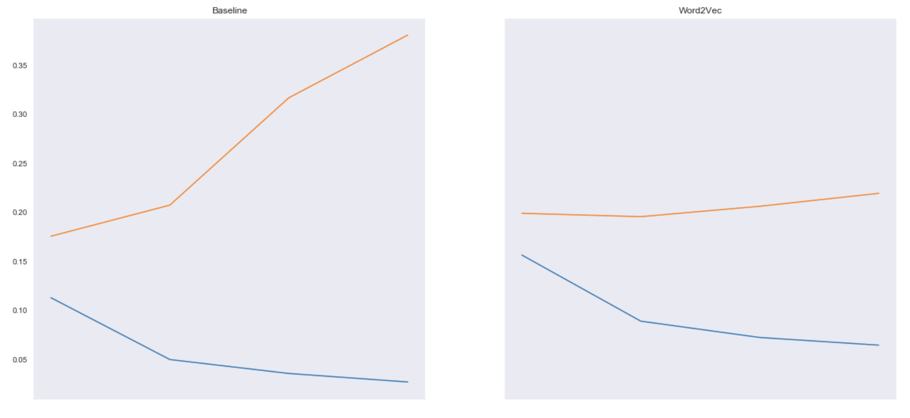
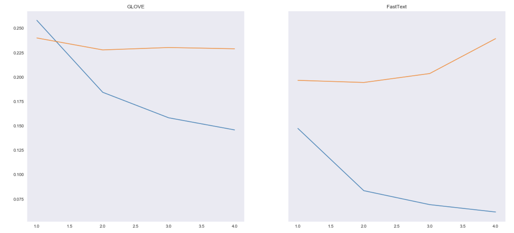
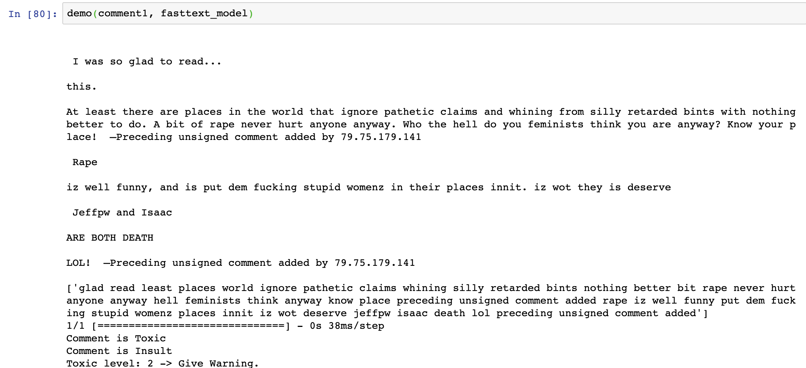

# Toxic Comments Classification

## Project Objectives 
- Predict the type/level of toxicity of online comments
- Comparing pretrained Embeddings: Word2Vec, GloVe, Fasttext and custom training embeddings.

## Business Aspects
- Provide an overview of the website e.g. if the website has toxic/adult content.
- The final product can be used for detecting the level of toxic comments on online flatforms and performing actions e.g. give warnings, block toxic comments, or require human check-up.
- Based on the toxicity level, users can filter out the type of language they are and are not interested in e.g some websites might allow profanity or obscenity.

## Dataset
- 150k Wikipedia comments
- Comments were rated by human with 6 labels:  **toxic, severe toxic, obscene, threat, insult, identity hate**

## Exploratory Data Analysis

- The comments are not spread out between classes. Hence we have **imbalance problems.**

- There are ~150k comments in the dataset. We have ~140k 'clean' comments and ~ 35k tagged comments --> There are **comments that have more than one tag.**

There are high correletions between classes:
   - Insult vs Obscene (0.74)
   - Toxic vs Obscene (0.68)
   - Toxic vs Insult (0.65)
   - Severe Toxic vs Obscene (0.40)
   
It might be because the definition of each class is not 100% distingushable. 

**Some different Observations**

 - A Severe Toxic comment is always Toxic
 - Almost all classes are a subset of Toxic
 - Some comments contain IP Adress and Username which can lead to overfitting

### Data Processing
 - Text cleaning: remove numbers, special characters, and stopwords
 - Create 'toxic_count' feature to access the level toxicity e.g if an comment is toxic, obscene and threat then its toxic level is 3
 - To deal with imbalance problem between classes, I perform stratified sampling for all classes and oversampling on classes  of which the amount of comments is much less than the other
 - Split dataset into train, validation and test sets
 
 
## Models
### Deep Learning
#### Custom Train Embedding
- I train the embeddings for baseline model using the comments from the dataset
- Architecture: 

**Input Layer:** Accept a list of encoded sentences that has a dimension of 200 (I set max_length = 200)

**->Embedding Layer:** Output 3D Tensor which is an array of sentences. For each word (200) in a sentence, there is an array of coordinates (128) in the vector space of embedding

**->LSTM Layer:** Recieve a tensor of shape (None, 200, 128) Recursively run the LSTM model for 200 times, passing the coordinates of each word everytime. Output dimension (None, 200, 60)

**->Global Max Pooling Layer:** Reshape 3D tensor to 2D

**->Drop Out Layer:** Randomly disable some nodes -> result in better generalization

**->Densely Connected Layer:** Output passes through a Relu function. Output dimision of 50

**->Drop Out Layer:** 1 more time

**->Densely Connected Layer:** This time with Sigmoid function because we are trying to achieve a binary classification for each of the 6 labels

**Optimizer:** Adam

**Loss Function:** Binary Cross-Entropy

## Pretrained Embeddings
### Word2Vec:
The main idea is that we train a model on the context of each words with 2 approches: Skip-gram, using the target word to predict its context and Continuous Bag of Word (CBOW), predicting which word is most likely given its context. So similar words will have similar representations.

#### GloVe:
GloVe is quite similar with Word2Vec, but instead of predicting context given word, GloVe learns by constructing a co-occurrence matrix (words X context) that basically count how frequently a word appears in a context.

####  Fasttext:
Instead of using words to build word embeddings, Fasttext uses of part of words and characters. A word becomes its context. The building stones are therefore characters instead of words.

- I use the same architecture as my custom trained embeddings. But for all three, instead of LSTM I used Bidirectional LSTM Layer that runs forward and backward at the same time resulting in preservation of information from both past and future. I also add LSTM Drop Out and Recurrent Drop Out for better generalization.

## Result

Training loss for Baseline model is the lowest.
However Validation loss is a lot higher than other models.

**Looking at other metrics**

**Recall** indicates how good the model is at retrieving toxic comments.

**Precision** indicates how good the model is at predicting toxic comment correctly. #at only retrieving toxic comments

**Type I error (False Positive)**: predict a comment is toxic when it's not.

**Type II error (False Negative)**: predict a comment is not toxic when in fact it is.

In case of predicting toxic comments, I think a model with high precision is better. For example, if we block a comment and that comment is not toxic, then the user who wrote the comment will be angry and might not use our website anymore. On the other hand, if a comment is toxic and we let it goes through, other users will likely report it and we can act on it later.
**Word2Vec** is a the best option in this case.

For cases of predicting threat, insult and identity hate, which are more serious and might potentitally happen, a model with high recall that can retrieve all of the comments in those classes is better. For example, if there are 10 death threats and we only able to detect 6 of them, that might be a big problem because there won't be any initial preventions of the other 4 threats that could turn into real actions. **GloVe** is great in this case.

### DEMO

### What's next
- Data: improve Stratified sampling and Oversampling
- Model: Tune models and add more layers for better performance

 
  
  

